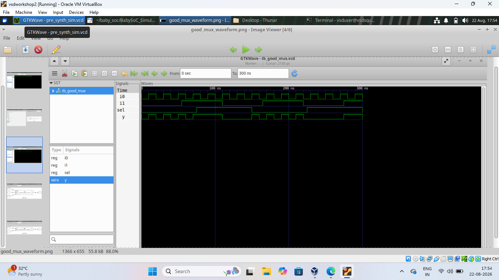
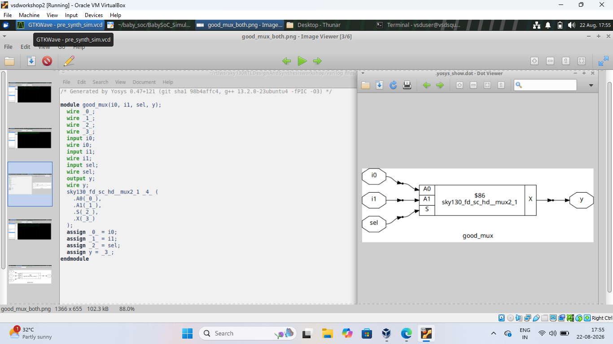

# Day 1 – Good MUX

## 📑 Index

1. [Objective](#objective)
2. [Design](#design)
3. [Simulation](#simulation)
4. [Synthesis](#synthesis)
5. [Results](#results)
6. [What I Learned](#what-i-learned)
7. [Conclusion](#conclusion)

---

## Objective

In this experiment, I designed a simple 2:1 Multiplexer using Verilog.
The design was first simulated to check its functionality and then
synthesized using Yosys.

---

## Design

The 2:1 MUX has two data inputs:

- `i0` – Input 0
- `i1` – Input 1

It has one select input:

- `sel` – Select input

And one output:

- `y` – Output

The working is simple:

- When `sel = 0`, the output `y` follows `i0`.
- When `sel = 1`, the output `y` follows `i1`.

---

## Simulation

I used **Icarus Verilog** to simulate the design and **GTKWave** to
observe the generated waveform.

The waveform shows the changes in `i0`, `i1`, `sel`, and `y`.
The output changes according to the selected input.

### GTKWave Result

---

## Synthesis

After simulation, I used **Yosys** for RTL synthesis.

The RTL design was mapped using the **Sky130 standard cell library**.
The synthesis result shows the MUX implementation using a Sky130
standard cell.

### Yosys Result

---

## Results

The simulation verified the correct working of the 2:1 MUX.

The synthesis result showed that the RTL MUX was successfully mapped
to a Sky130 standard cell.

---

## What I Learned

From this experiment, I learned:

- How to write a basic MUX using Verilog.
- How to simulate a Verilog design using Icarus Verilog.
- How to generate a VCD waveform.
- How to view waveforms using GTKWave.
- How to synthesize RTL using Yosys.
- How RTL logic is mapped to standard cells.

---

## Conclusion

The 2:1 MUX was successfully simulated and synthesized.
The GTKWave waveform verified the functionality of the design, and the
Yosys result showed the corresponding standard-cell implementation.

---

### 🔝 Back to Index

[Back to Index](#-index)
