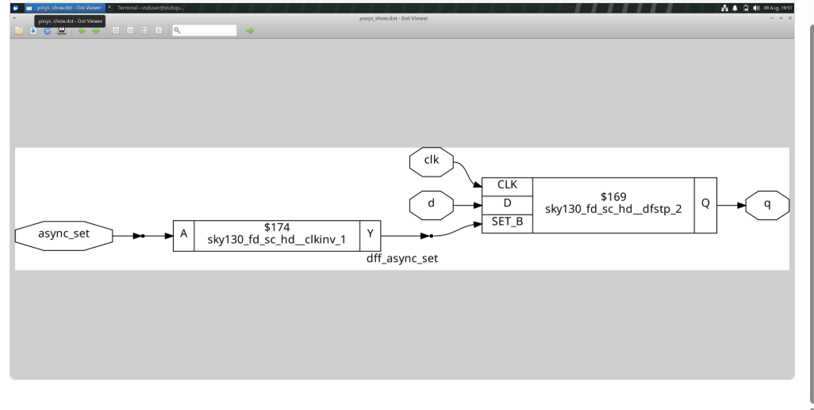
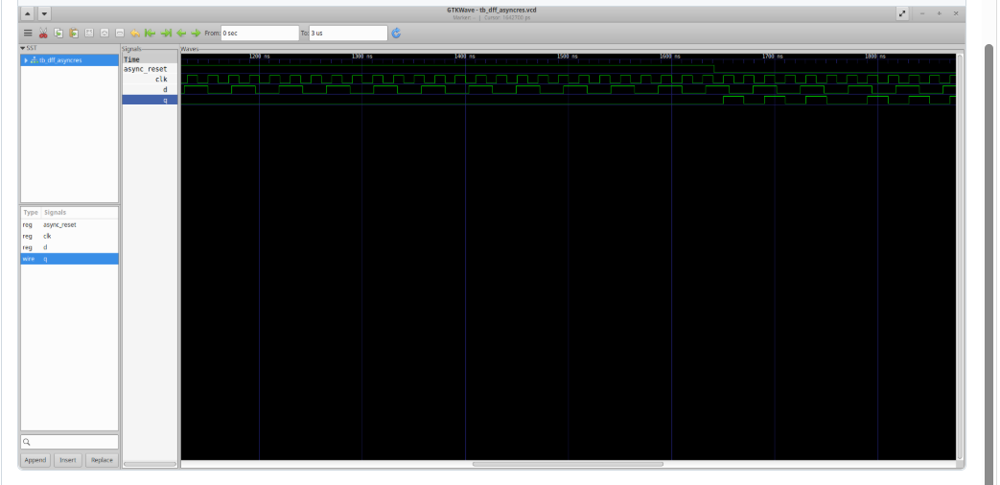
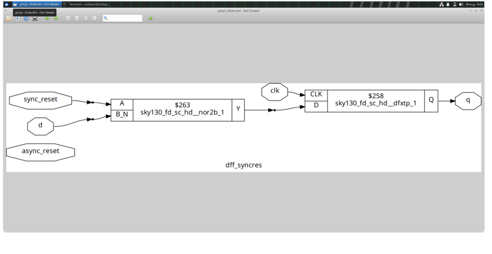
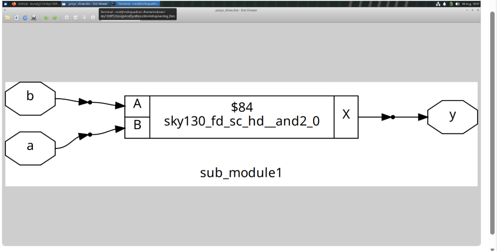
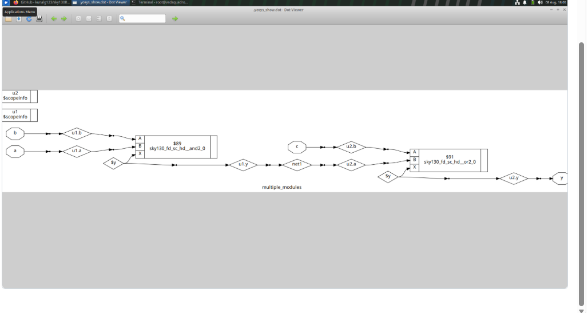

# Day 2 - Sequential Logic, Reset Techniques and Hierarchical Design

Day 2 focuses on understanding sequential logic, different
reset techniques, and hierarchical RTL design.

In this session, I worked with D flip-flops using asynchronous
and synchronous reset techniques. I also explored multiple
modules, sub-modules, and netlist flattening using Yosys.

The designs were simulated to verify their functionality and
then synthesized to understand their hardware implementation.

---

# Index

1. [Objective](#1-objective)
2. [Asynchronous Reset](#2-asynchronous-reset)
3. [D Flip-Flop with Asynchronous Reset](#3-d-flip-flop-with-asynchronous-reset)
4. [D Flip-Flop with Synchronous Reset](#4-d-flip-flop-with-synchronous-reset)
5. [Sub-Module Design](#5-sub-module-design)
6. [Multiple Modules](#6-multiple-modules)
7. [Flattening the Netlist](#7-flattening-the-netlist)
8. [Overall Learning](#8-overall-learning)
9. [Conclusion](#9-conclusion)

---

# 1. Objective

The main objective of Day 2 was to understand sequential
logic and different ways of describing reset behavior in RTL.

The main concepts covered were:

- D flip-flop
- Asynchronous reset
- Synchronous reset
- Clock signal
- Reset signal
- Sequential logic
- RTL simulation
- Yosys synthesis
- Sub-module design
- Multiple module hierarchy
- Netlist flattening

---

# 2. Asynchronous Reset

## What I designed

In this experiment, I worked with a D flip-flop having an
asynchronous reset.

An asynchronous reset can change the output of the flip-flop
independently of the clock signal.

When the reset is activated, the output is immediately forced
to its reset value.

The main signals involved are:

- `clk` - Clock signal
- `d` - Data input
- `async_reset` - Asynchronous reset
- `q` - Output

## Working

When the asynchronous reset is active, the flip-flop output
is reset without waiting for a clock edge.

When the reset is inactive, the flip-flop captures the input
data according to the clock.

## Synthesis Result

The design was synthesized using Yosys to observe how the
asynchronous reset is represented in the hardware.

## Result

This experiment helped me understand that an asynchronous
reset operates independently of the clock and can reset the
sequential element immediately.

---

# 3. D Flip-Flop with Asynchronous Reset

## What I designed

In this experiment, a D flip-flop with asynchronous reset
was simulated and its waveform was observed.

The flip-flop stores the input data and updates its output
according to the clock signal when the reset is inactive.

When the asynchronous reset is activated, the output changes
to the reset state immediately.

## Simulation

The design was simulated and the waveform was viewed using
GTKWave.

The waveform was used to observe:

- Clock transitions
- Data input
- Asynchronous reset
- Output response

## Result

The simulation confirmed that the asynchronous reset affects
the output independently of the clock.

---

# 4. D Flip-Flop with Synchronous Reset

## What I designed

In this experiment, I worked with a D flip-flop using a
synchronous reset.

Unlike an asynchronous reset, a synchronous reset affects
the output only when the active clock edge occurs.

The main signals involved are:

- `clk` - Clock signal
- `d` - Data input
- `reset` - Synchronous reset
- `q` - Output

## Working

When the reset is active, the output is reset at the
appropriate clock edge.

When the reset is inactive, the flip-flop captures the
input data on the clock edge.

## Simulation and Synthesis

The design was simulated and synthesized to understand
the difference between synchronous and asynchronous reset
implementation.

## Result

This experiment helped me understand that a synchronous
reset depends on the clock edge, whereas an asynchronous
reset can affect the output independently of the clock.

---

# 5. Sub-Module Design

## What I designed

In this experiment, I worked with a design containing a
sub-module.

A sub-module is a smaller RTL module that can be instantiated
inside another module.

Using sub-modules helps divide a large design into smaller
and reusable blocks.

The design contains:

- Input signals
- A sub-module
- Output signal

## Working

The input signals are connected to the sub-module.

The sub-module performs its assigned logic and produces an
output that can be used by the main module.

## Synthesis

Yosys was used to synthesize the hierarchical RTL design.

The synthesized representation shows the relationship
between the main module and the sub-module.

## Result

This experiment helped me understand how hierarchical RTL
designs are created using sub-modules.

---

# 6. Multiple Modules

## What I designed

In this experiment, I worked with a design containing
multiple RTL modules.

A large digital system can be divided into several modules,
where each module performs a specific function.

This approach makes the design easier to understand,
debug, reuse, and maintain.

## Working

The output of one module can be connected to the input of
another module.

This creates a hierarchy in the overall RTL design.

## Synthesis

Yosys was used to synthesize the multiple-module design.

The generated representation shows how the individual
modules are connected together.

## Result

This experiment helped me understand hierarchical design
and how multiple RTL modules can be combined to form a
larger digital circuit.

---

# 7. Flattening the Netlist

## What I designed

In this experiment, I studied the process of flattening
a hierarchical RTL design.

Normally, a design may contain a top-level module and
several sub-modules.

During flattening, the hierarchy is removed and the logic
from the lower-level modules is combined into the top-level
design.

## Why Flattening is Used

Flattening can make the complete design easier for synthesis
and optimization tools to analyze.

It allows the synthesis tool to view the complete logic as
one interconnected design.

## Synthesis

Yosys was used to generate and examine the flattened netlist.

The flattened representation shows the internal logic
without keeping the original module hierarchy.

## Result

This experiment helped me understand the difference between
hierarchical RTL representation and a flattened netlist.

---

# 8. Overall Learning

Through the experiments performed on Day 2, I understood
the following:

- Working principle of a D flip-flop.
- Importance of clock signals in sequential circuits.
- Difference between asynchronous and synchronous reset.
- Behavior of asynchronous reset.
- Behavior of synchronous reset.
- How RTL designs are simulated.
- How GTKWave is used to observe waveforms.
- How Yosys is used for RTL synthesis.
- How sub-modules are created and instantiated.
- How multiple modules can be connected together.
- Concept of hierarchical RTL design.
- Purpose of flattening a netlist.
- Relationship between RTL hierarchy and synthesized hardware.

---

# 9. Conclusion

Day 2 helped me understand important concepts related to
sequential logic and RTL design.

I worked with D flip-flops, asynchronous reset, synchronous
reset, sub-modules, multiple modules, and flattened netlists.

By performing simulation and synthesis, I understood how RTL
descriptions are converted into hardware representations.

This session also helped me understand how hierarchical
design techniques can be used to organize complex digital
circuits and how synthesis tools such as Yosys process
these designs.
