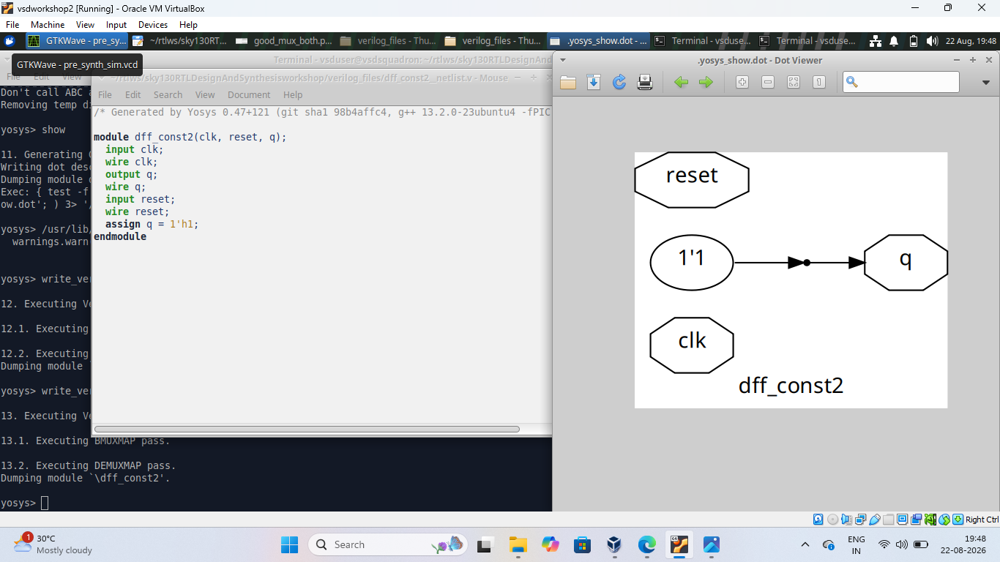
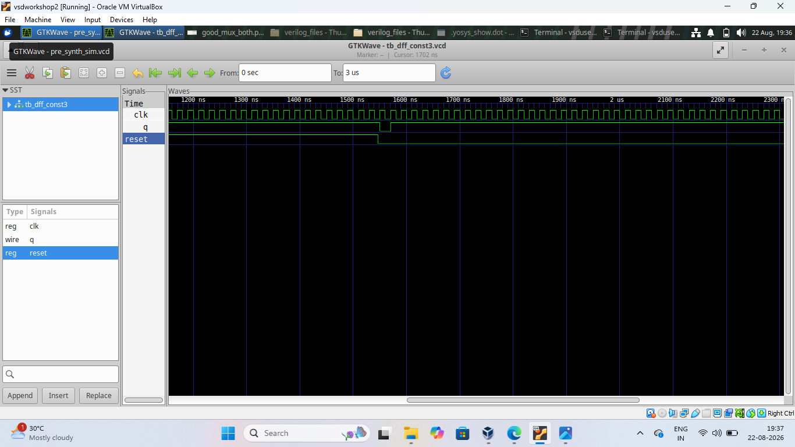
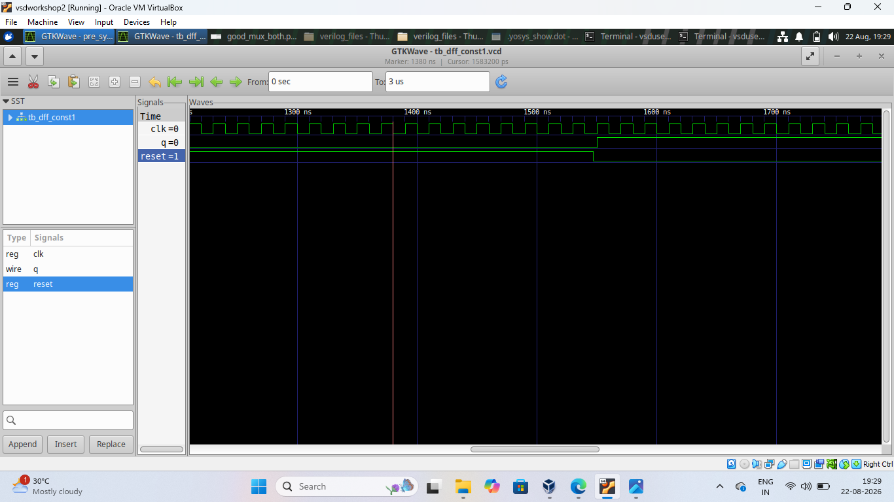
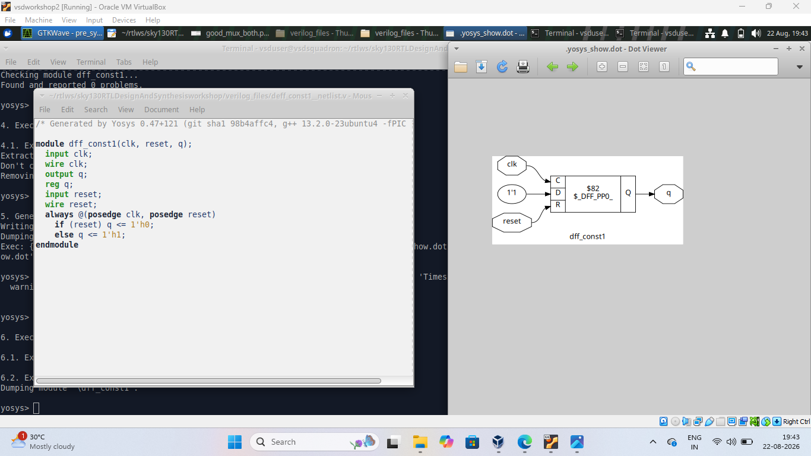
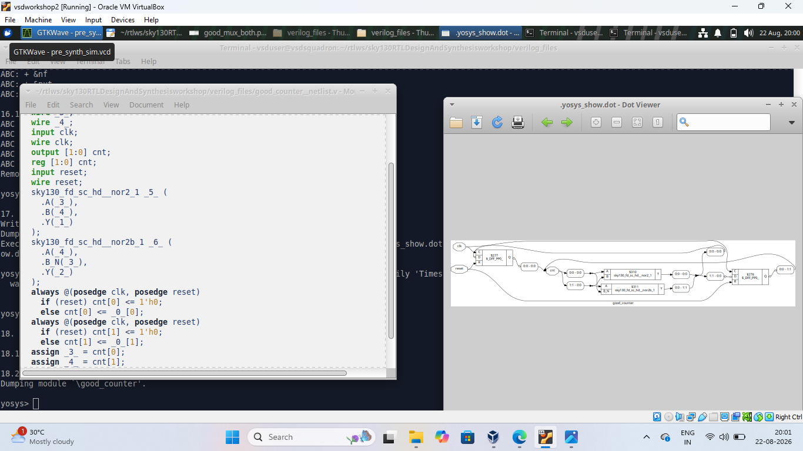
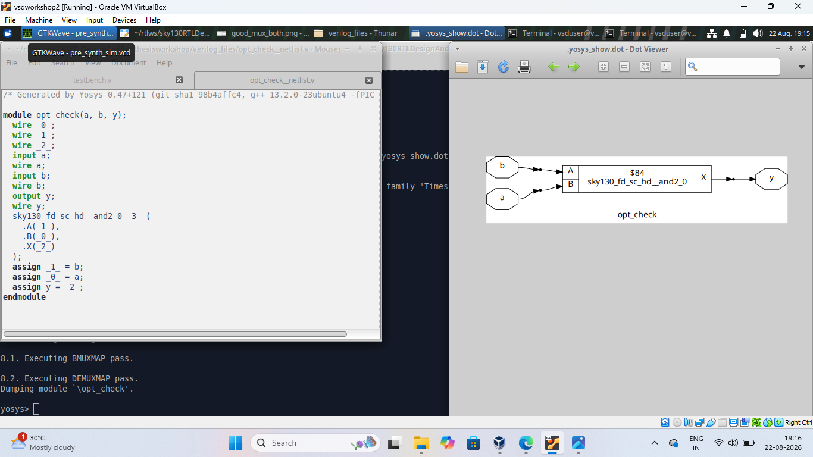
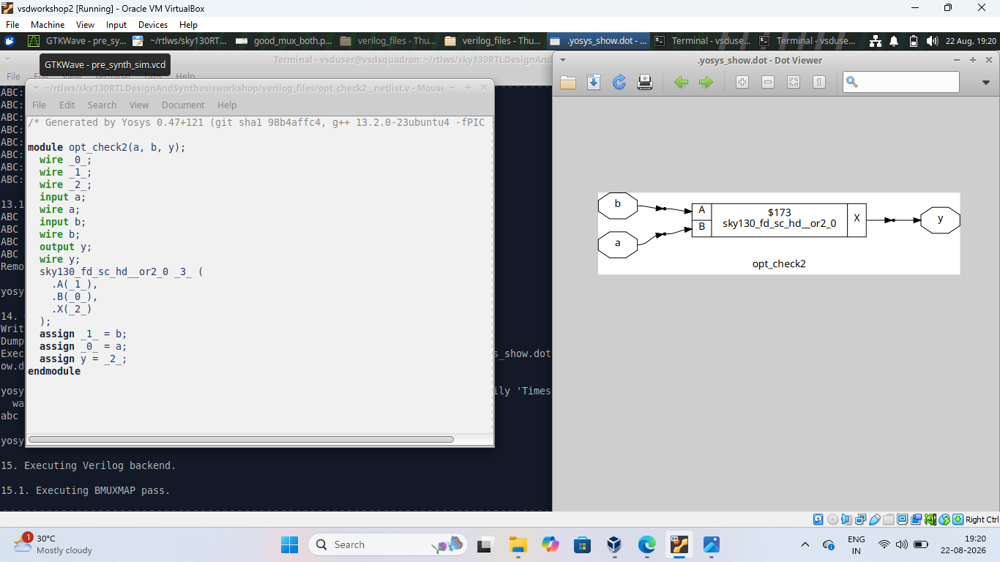
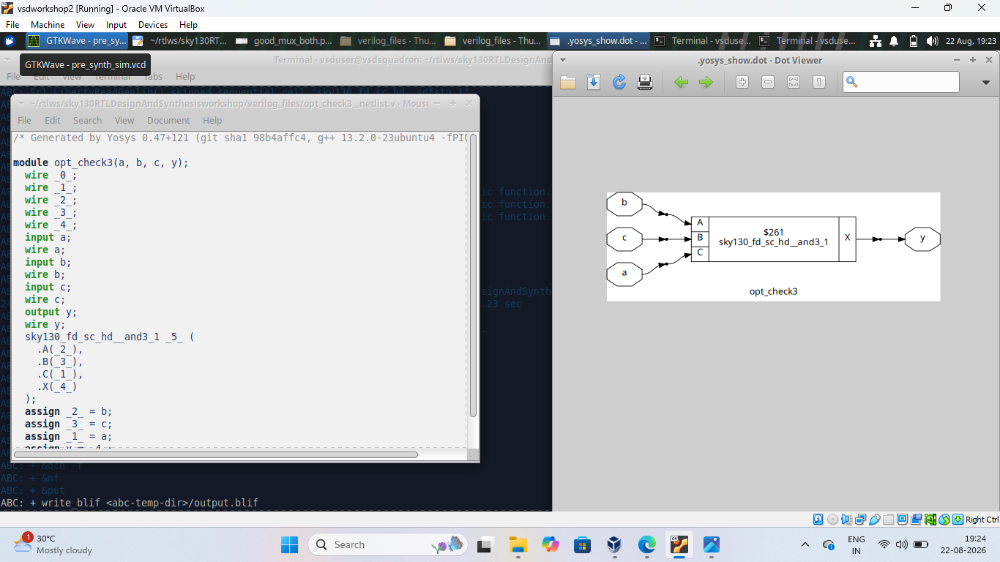

# Day 3 - RTL Optimization and Sequential Logic

Day 3 focuses on understanding how simple RTL designs are converted,
simulated, synthesized, and optimized using Yosys.

In this session, I worked with D flip-flops, constant logic,
a counter, and different logic optimization examples.

---

# Index

1. [Objective](#1-objective)
2. [DFF Constant 2](#2-dff-constant-2)
3. [DFF Constant 3](#3-dff-constant-3)
4. [DFF Constant](#4-dff-constant)
5. [Good Counter](#5-good-counter)
6. [Optimization Check](#6-optimization-check)
7. [Optimization Check 2](#7-optimization-check-2)
8. [Optimization Check 3](#8-optimization-check-3)
9. [Overall Learning](#9-overall-learning)
10. [Conclusion](#10-conclusion)

---

# 1. Objective

The main objective of Day 3 was to understand how Yosys
optimizes RTL designs during synthesis.

The main concepts covered were:

- D flip-flop based designs
- Clock and reset signals
- Constant propagation
- Removal of unnecessary logic
- Logic optimization
- Counter design
- RTL simulation using GTKWave
- RTL synthesis using Yosys
- Comparison between RTL and synthesized logic

---

# 2. DFF Constant 2

## What I designed

In this experiment, I created a D flip-flop with a constant
value connected to its data input.

The design contains:

- Clock (`clk`)
- Reset (`reset`)
- Output (`q`)
- Constant value connected to the D input

The purpose was to see how Yosys handles a flip-flop whose
input is always a constant value.

## Simulation

The design was simulated and the waveform was viewed using
GTKWave.

The clock and reset signals were observed along with the
output `q`.

### GTKWave Simulation Result

## Synthesis

After synthesis, Yosys analyzed the constant input and
simplified the design.

Since the D input does not depend on another changing logic
signal, the synthesized circuit can be much simpler than
the original RTL description.

### Yosys Synthesis Result

## Files

- `deff_const2_gtk.png` - GTKWave simulation result
- `deff_const2_yosys.png` - Yosys synthesized circuit

---

# 3. DFF Constant 3

## What I designed

This experiment is another D flip-flop example used to
understand how constant values and sequential logic are
handled during synthesis.

The design contains:

- Clock (`clk`)
- Reset (`reset`)
- D flip-flop
- Output (`q`)

The experiment helps demonstrate how Yosys identifies
constant behavior and simplifies the resulting circuit.

## Simulation

The design was simulated using the Verilog simulation flow
and the waveform was observed in GTKWave.

The waveform was used to check the behavior of the clock,
reset, and output signals.

### GTKWave Simulation Result

## Synthesis

The RTL was synthesized using Yosys.

Yosys optimized the original description and generated a
simplified gate-level representation.

### Yosys Synthesis Result

## Files

- `deff_const3_gtk.png` - GTKWave result
- `deff_const3_yosys.png` - Yosys synthesized result

---

# 4. DFF Constant

## What I designed

This experiment demonstrates a D flip-flop whose output is
determined by constant logic.

The purpose was to understand what happens when a sequential
element receives a fixed value instead of a normal changing
data signal.

## Simulation

The design was simulated and the output waveform was
observed using GTKWave.

The clock and reset behavior were checked during simulation.

### GTKWave Simulation Result

## Synthesis

Yosys synthesized the design and generated the corresponding
logic representation.

The synthesized result shows how constant logic can be
recognized and simplified during synthesis.

### Yosys Synthesis Result

## Files

- `dff_const_gtk.png` - GTKWave waveform
- `dff_const_yosys.png` - Yosys synthesized circuit

---

# 5. Good Counter

## What I designed

In this experiment, I worked with a counter implemented using
sequential logic.

A counter changes its output according to the clock signal.
A reset signal is used to initialize the counter.

The main signals involved are:

- Clock (`clk`)
- Reset (`reset`)
- Counter output

## Simulation

The counter was simulated to verify its behavior.

GTKWave was used to observe the clock, reset, and counter
output over time.

The waveform helps verify that the counter changes according
to the applied clock and reset conditions.

### Simulation Result

## Synthesis

The counter was synthesized using Yosys.

Yosys converted the RTL description into a gate-level
representation using available standard cells.

## Result

The synthesized counter shows how sequential RTL logic is
mapped into hardware structures.

## File

- `good_counter.png` - Counter result

---

# 6. Optimization Check

## What I designed

This experiment was created to understand how Yosys performs
logic optimization on a simple combinational expression.

The RTL contains simple logic operations that can be reduced
during synthesis.

## Simulation

The design was simulated to verify that the output follows
the expected Boolean behavior for different input values.

## Synthesis

Yosys analyzed the RTL and optimized the logic.

The synthesized diagram shows the simplified hardware
required to implement the logic.

### Synthesis Result

## Result

This experiment demonstrates that Yosys does not simply
convert every RTL statement directly into a separate gate.

Instead, it analyzes the logic and removes unnecessary
operations whenever possible.

## File

- `opt_check.png` - Synthesized logic result

---

# 7. Optimization Check 2

## What I designed

This experiment uses another simple logic expression to
observe the optimization performed by Yosys.

The purpose was to see whether Yosys can recognize the
simplest hardware implementation of the given RTL.

## Synthesis

After synthesis, Yosys optimized the logic and mapped it
to the required standard cell.

The generated diagram shows the optimized implementation.

### Synthesis Result

## Result

The result demonstrates how Boolean simplification can
reduce the amount of hardware required.

## File

- `opt_check2.png` - Yosys synthesized result

---

# 8. Optimization Check 3

## What I designed

This experiment is another optimization example using
simple combinational logic.

The RTL was passed through the Yosys synthesis flow to
observe how the original logic is simplified.

## Synthesis

Yosys performed its optimization passes and generated a
simplified gate-level representation.

The synthesized diagram shows the final logic cell used
after optimization.

### Synthesis Result

## Result

This experiment helped me understand that different RTL
expressions can sometimes result in a much simpler hardware
implementation after synthesis.

## File

- `opt_check3.png` - Yosys synthesized result

---

# 9. Overall Learning

Through these experiments, I understood the following:

- How D flip-flops are represented in RTL.
- How clock and reset signals affect sequential circuits.
- How constant inputs can simplify a circuit.
- How Yosys performs constant propagation.
- How unnecessary logic is removed during synthesis.
- How combinational logic is optimized.
- How counters are implemented using sequential logic.
- How GTKWave is used to verify simulation waveforms.
- How Yosys generates a synthesized circuit representation.
- How RTL code and synthesized hardware are related.

---

# 10. Conclusion

Day 3 helped me understand the importance of synthesis
optimization in digital design.

I worked with D flip-flops, constant logic, counters, and
combinational optimization examples.

By comparing the RTL design, simulation results, and
synthesized circuits, I understood how Yosys transforms
RTL code into optimized hardware while preserving the
required functionality.
