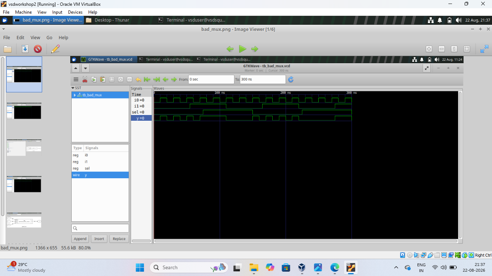
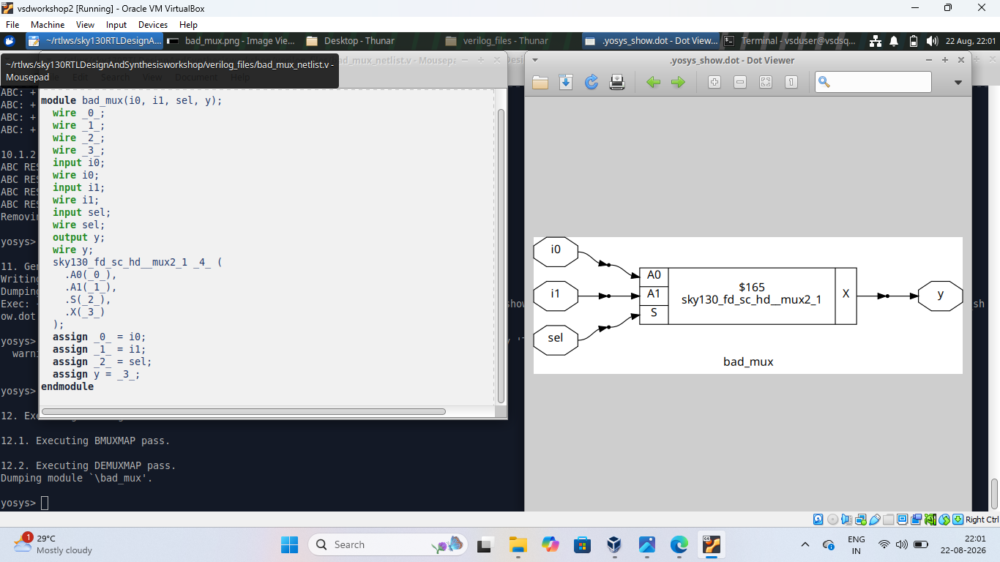
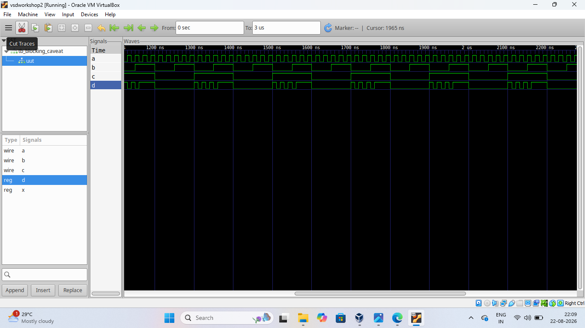
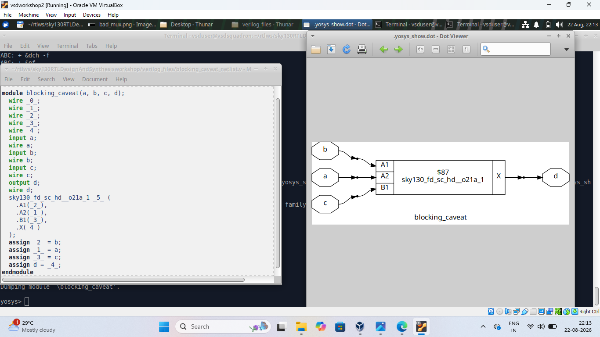
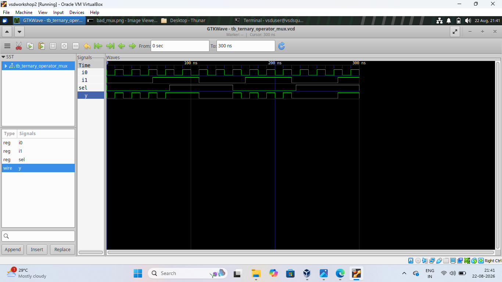
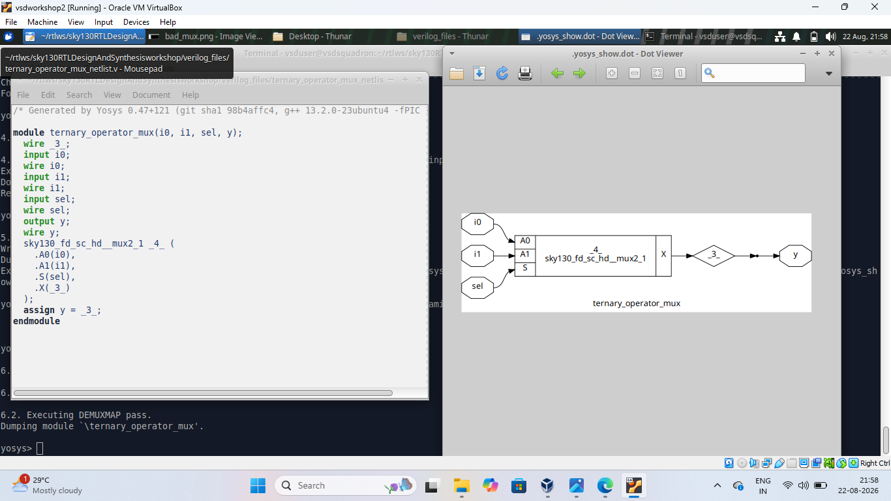

# Day 4 - RTL Coding Practices and MUX Design

Day 4 focuses on understanding different RTL coding styles
and how they affect simulation and synthesis.

In this session, I worked with a 2:1 MUX, blocking assignment
behavior, and a MUX implemented using the Verilog ternary
operator.

The designs were simulated using GTKWave and synthesized
using Yosys to understand how RTL descriptions are converted
into hardware.

---

# Index

1. [Objective](#1-objective)
2. [Bad MUX](#2-bad-mux)
3. [Blocking Caveat](#3-blocking-caveat)
4. [Ternary Operator MUX](#4-ternary-operator-mux)
5. [Overall Learning](#5-overall-learning)
6. [Conclusion](#6-conclusion)

---

# 1. Objective

The main objective of Day 4 was to understand how different
RTL coding styles can affect the behavior and synthesized
hardware of a digital circuit.

The main concepts covered were:

- 2:1 MUX design
- RTL coding styles
- Blocking assignments
- Combinational logic
- Ternary operator
- RTL simulation using GTKWave
- RTL synthesis using Yosys
- Understanding synthesized hardware
- Comparing RTL description with synthesized logic

---

# 2. Bad MUX

## What I designed

In this experiment, I designed a simple 2:1 multiplexer
using Verilog RTL.

A 2:1 MUX has two data inputs, one select input, and one
output.

The inputs used were:

- `i0` - First data input
- `i1` - Second data input
- `sel` - Select signal
- `y` - Output

The select signal determines which input is transferred
to the output.

The basic operation of the MUX is:

- When `sel = 0`, the output follows `i0`.
- When `sel = 1`, the output follows `i1`.

The experiment was called "Bad MUX" to study the RTL
implementation and understand how the written RTL is
converted into hardware.

## Simulation

The MUX was simulated using the Verilog simulation flow.

GTKWave was used to observe the input signals, select
signal, and output waveform.

The waveform was checked to verify that the output changes
according to the selected input.

### GTKWave Result

## Synthesis

The design was synthesized using Yosys.

Yosys converted the RTL description into a gate-level
representation using a standard MUX cell.

The synthesized diagram shows the two inputs connected to
the MUX, along with the select signal and output.

### Yosys Result

## Result

The experiment helped me understand how a simple MUX written
in RTL is mapped into a corresponding hardware cell during
synthesis.

---

# 3. Blocking Caveat

## What I designed

In this experiment, I studied the behavior of blocking
assignments in RTL design.

The design uses multiple logic operations and blocking
assignments to understand how statements are evaluated
during simulation.

Blocking assignments execute sequentially within the
procedural block. Therefore, the order of statements can
affect the intermediate values and the final result.

This is an important concept when writing combinational
RTL logic.

## Simulation

The design was simulated and the resulting signals were
observed using GTKWave.

The waveform contains the input signals and output signals
used in the design.

The simulation helps to understand how the blocking
assignments affect signal behavior.

### GTKWave Result

## Synthesis

The RTL was synthesized using Yosys.

The synthesized result shows how the RTL description is
converted into hardware logic.

The generated circuit contains the required logic cells
based on the operations described in the RTL.

### Yosys Result

## Result

This experiment helped me understand that the order of
blocking assignments can be important in RTL coding.

It also showed how the RTL description is interpreted during
synthesis and converted into hardware.

---

# 4. Ternary Operator MUX

## What I designed

In this experiment, I implemented a 2:1 MUX using the
Verilog ternary operator.

The ternary operator provides a compact way to describe
conditional logic.

The basic form used for a MUX is:

`y = sel ? i1 : i0;`

This means:

- If `sel = 1`, `i1` is selected.
- If `sel = 0`, `i0` is selected.

The design contains:

- `i0` - First input
- `i1` - Second input
- `sel` - Select signal
- `y` - Output

## Simulation

The ternary operator MUX was simulated using the Verilog
simulation flow.

GTKWave was used to observe the values of `i0`, `i1`,
`sel`, and `y`.

The waveform confirms that the output follows the selected
input according to the select signal.

### GTKWave Result

## Synthesis

The design was synthesized using Yosys.

Yosys recognized the ternary operator as MUX functionality
and mapped the RTL into a standard MUX cell.

The synthesized diagram shows the two inputs connected to
the MUX, the select signal, and the resulting output.

### Yosys Result

## Result

This experiment demonstrated that the Verilog ternary
operator can be used as a simple and readable way to
describe a multiplexer.

It also showed that Yosys can recognize the intended
hardware functionality and convert it into a MUX cell
during synthesis.

---

# 5. Overall Learning

Through these experiments, I understood the following:

- How to design a 2:1 MUX using RTL.
- How MUX inputs and select signals control the output.
- How RTL coding style affects circuit behavior.
- How blocking assignments are evaluated sequentially.
- Why the order of blocking assignments can be important.
- How the Verilog ternary operator can describe a MUX.
- How GTKWave can be used to verify RTL simulation.
- How Yosys synthesizes RTL into hardware cells.
- How different RTL descriptions can produce similar
  hardware after synthesis.
- How to compare simulation results with synthesized
  circuit diagrams.

---

# 6. Conclusion

Day 4 helped me understand the relationship between RTL
coding style, simulation, and synthesis.

I worked with a 2:1 MUX, blocking assignments, and a
ternary-operator based MUX.

By observing the GTKWave simulation results and Yosys
synthesis diagrams, I gained a better understanding of how
Verilog RTL descriptions are interpreted and converted
into hardware.

These experiments also helped me understand the importance
of writing clear and correct RTL code for reliable digital
design.
