# Day 5 - Incomplete Conditional Logic and Case Statements

Day 5 focuses on understanding incomplete conditional statements,
case statements, multiplexers, demultiplexers, partial assignments,
and their effect on RTL simulation and logic synthesis.

In this session, I worked with incomplete `if` statements, incomplete
case statements, bad and complete case statements, multiplexers,
demultiplexers, partial case assignments, and a Ripple Carry Adder.

The RTL designs were simulated using Icarus Verilog and the waveforms
were observed using GTKWave. The designs were synthesized using Yosys
to analyze the resulting netlists and block diagrams.

---

# Index

1. [Objective](#1-objective)
2. [Incomplete IF](#2-incomplete-if)
3. [Incomplete IF 2](#3-incomplete-if-2)
4. [Incomplete Case](#4-incomplete-case)
5. [Bad Case](#5-bad-case)
6. [Complete Case](#6-complete-case)
7. [MUX Generate](#7-mux-generate)
8. [DEMUX Generate](#8-demux-generate)
9. [DEMUX Case](#9-demux-case)
10. [Partial Case Assignment](#10-partial-case-assignment)
11. [Ripple Carry Adder](#11-ripple-carry-adder)
12. [RTL Simulation and Waveform Analysis](#12-rtl-simulation-and-waveform-analysis)
13. [Synthesis and Netlist Analysis](#13-synthesis-and-netlist-analysis)
14. [Latch Inference](#14-latch-inference)
15. [Overall Learning](#15-overall-learning)
16. [Conclusion](#16-conclusion)

---

# 1. Objective

The main objective of Day 5 was to understand how incomplete
conditional assignments and different RTL coding styles affect
simulation and synthesis.

The main concepts covered were:

- Incomplete `if` statements
- Incomplete `case` statements
- Complete case statements
- Bad case statements
- Latch inference
- Multiplexer design
- Demultiplexer design
- Partial case assignments
- Ripple Carry Adder
- RTL simulation using GTKWave
- Gate-level simulation
- RTL synthesis using Yosys
- Netlist and block diagram analysis

---

# 2. Incomplete IF

## What I designed

In this experiment, I worked with an incomplete `if` statement.

An incomplete `if` statement occurs when an output is assigned only
for one condition and no assignment is provided for the other
condition.

For example:

```verilog
always @(*) begin
    if (i0)
        y = i1;
end
```

When `i0` is `0`, the output `y` is not assigned.

Therefore, the synthesis tool may infer a latch to retain the
previous value of `y`.

## Simulation

The design was simulated using Icarus Verilog and the waveform was
observed using GTKWave.

The input signals and output `y` were observed during simulation.

### GTKWave Simulation Result

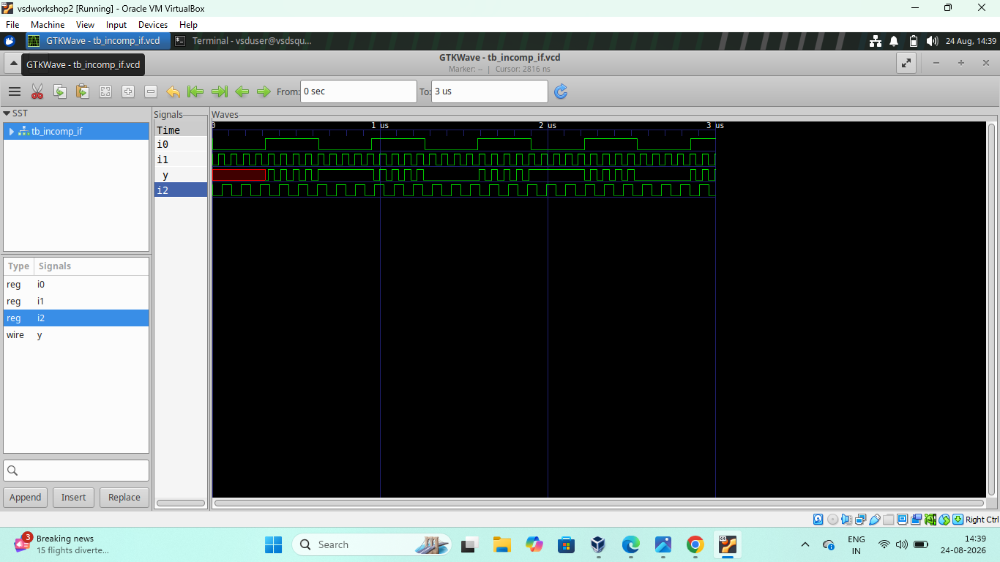

## Synthesis

The design was synthesized using Yosys.

The synthesized circuit contains a latch element because the output
is not assigned for every possible condition.

### Yosys Synthesis Result

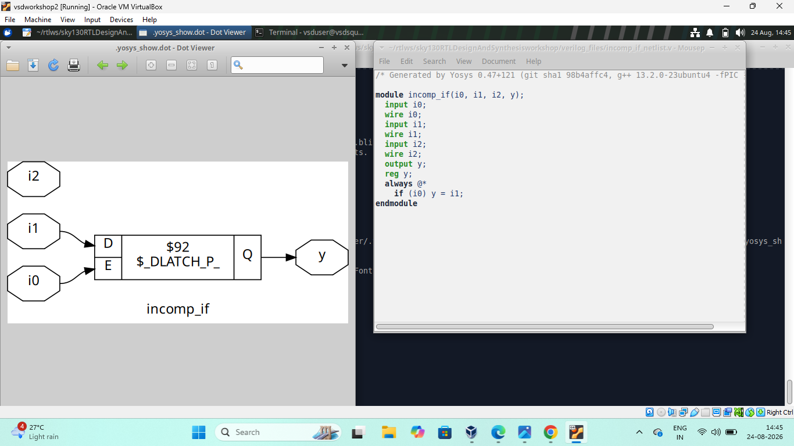

## Result

This experiment helped me understand that incomplete conditional
assignments can result in latch inference during synthesis.

## Files

- `incomp_if_v_gtk.png` - GTKWave simulation result
- `incomp_if_yosys.png` - Yosys synthesized result

---

# 3. Incomplete IF 2

## What I designed

This experiment is another example of an incomplete `if` design.

The design uses multiple input signals and conditional logic. The
output is not assigned for every possible input condition.

The purpose was to understand how Yosys handles incomplete
conditional logic containing multiple signals.

## Simulation

The design was simulated using the Verilog simulation flow and the
waveform was observed using GTKWave.

The input signals `i0`, `i1`, `i2`, and `i3` and the output `y` were
observed.

### GTKWave Simulation Result

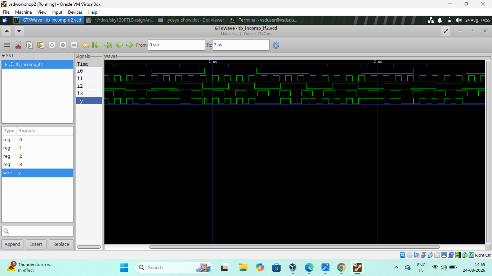

## Synthesis

The RTL was synthesized using Yosys.

The synthesized design contains multiplexer logic and a latch because
the conditional assignment is incomplete.

### Yosys Synthesis Result

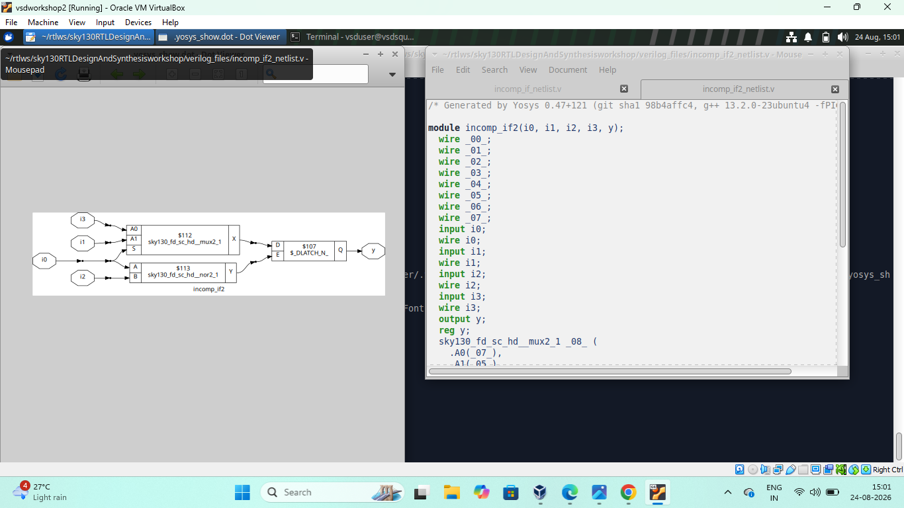

## Result

This experiment helped me understand that incomplete conditional
logic can generate additional hardware such as latches.

## Files

- `incomp_if2_gtk.png` - GTKWave simulation result
- `incomp_if2_yosys.png` - Yosys synthesized result

---

# 4. Incomplete Case

## What I designed

In this experiment, I worked with an incomplete `case` statement.

A case statement is commonly used to implement selection logic.

An incomplete case statement occurs when assignments are not provided
for all possible values of the select signal.

When the output is not assigned for some conditions, the synthesis
tool may infer a latch.

## Simulation

The design was simulated using Icarus Verilog and the waveform was
observed using GTKWave.

The clock, input signals, reset, select signal, and output were
observed during simulation.

### GTKWave Simulation Result

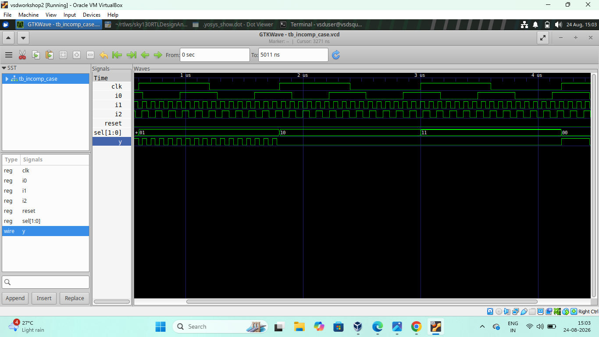

## Synthesis

The design was synthesized using Yosys.

The synthesized circuit contains multiplexing logic and a latch due
to the incomplete case assignment.

### Yosys Synthesis Result


## Result

This experiment demonstrated how an incomplete case statement can
result in latch inference during synthesis.

## Files

- `incomp_case_gtk.png` - GTKWave simulation result
- `incomp_case_yosys.png` - Yosys synthesized result

---

# 5. Bad Case

## What I designed

In this experiment, I worked with a bad or improperly specified case
statement.

The purpose was to understand how incomplete or improperly specified
case assignments affect the output during simulation and the hardware
generated during synthesis.

## Simulation

The design was simulated using GTKWave.

The input signals, select signal, reset, and output were observed for
different combinations.

### GTKWave Simulation Result

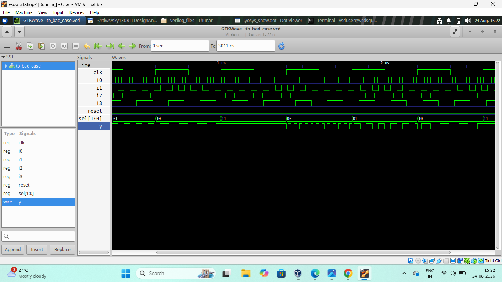

## Gate-Level Simulation

Gate-level simulation was also performed after synthesis.

The gate-level waveform was observed to verify the synthesized
implementation.

### Gate-Level Simulation Result


## Synthesis

The design was synthesized using Yosys.

The synthesized netlist and block diagram were analyzed to understand
the hardware generated from the RTL description.

### Yosys Synthesis Result

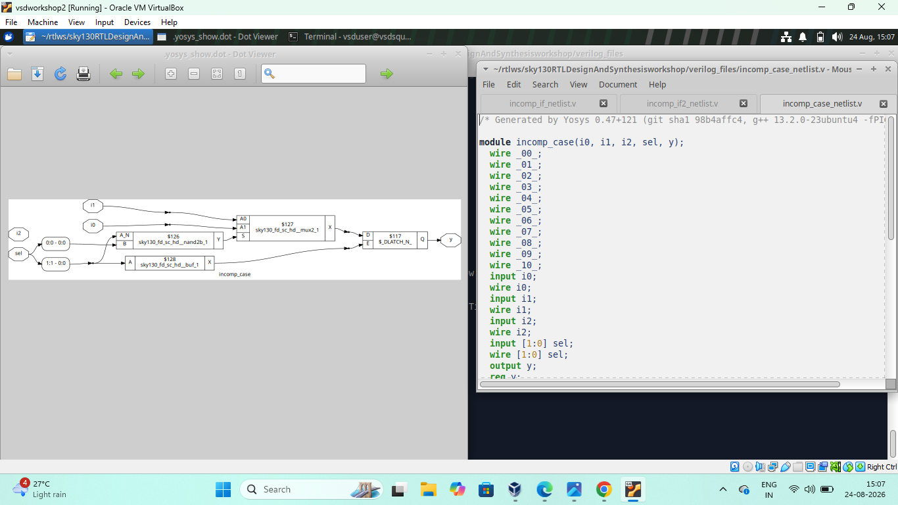

## Result

This experiment helped me understand the effect of incomplete or
improper case statements on the synthesized hardware.

## Files

- `bad_case_gtk.png` - GTKWave simulation result
- `bad_case_gls.png` - Gate-level simulation result
- `bad_case_yosys.png` - Yosys synthesized result

---

# 6. Complete Case

## What I designed

In this experiment, I worked with a complete case statement.

A complete case statement provides an assignment for every possible
condition.

Complete case statements are useful for designing combinational logic
without unintended latch inference.

## Synthesis

The design was synthesized using Yosys.

The synthesized netlist and block diagram were observed to understand
the hardware generated from the complete case statement.

### Yosys Synthesis Result


## Result

This experiment helped me understand that complete assignments allow
the synthesis tool to implement the intended combinational logic
without unnecessary storage elements.

## File

- `comp_case_yosys.png` - Yosys synthesized result

---

# 7. MUX Generate

## What I designed

In this experiment, I worked with a Multiplexer.

A Multiplexer, or MUX, is a combinational circuit that selects one
input from multiple input signals and transfers the selected input to
the output.

The selection is controlled using select lines.

The experiment was used to understand MUX implementation using RTL.

## Simulation

The MUX was simulated and the waveform was observed using GTKWave.

The input signals, select signal, and output were observed during
simulation.

### GTKWave Simulation Result


## Synthesis

The MUX design was synthesized using Yosys.

The synthesized netlist and block diagram show the hardware
implementation of the multiplexer.

### Yosys Synthesis Result

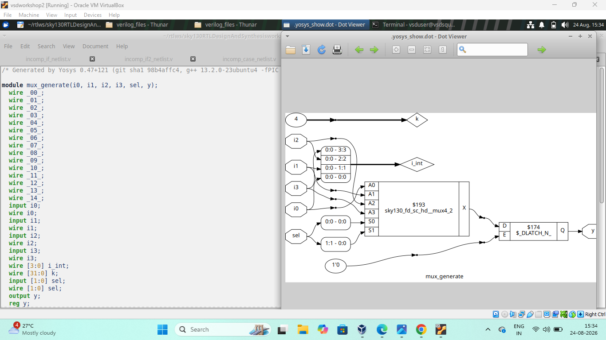

## Result

This experiment helped me understand how a multiplexer is described
using RTL and converted into hardware during synthesis.

## Files

- `mux_generate_gtk.png` - GTKWave simulation result
- `mux_generate_yosys.png` - Yosys synthesized result

---

# 8. DEMUX Generate

## What I designed

In this experiment, I worked with a Demultiplexer.

A Demultiplexer, or DEMUX, takes a single input and routes it to one
of several output lines depending on the select signal.

The design was used to understand signal routing using select lines.

## Simulation

The DEMUX was simulated using the Verilog simulation flow.

GTKWave was used to observe the input, select signal, and output
signals.

### GTKWave Simulation Result

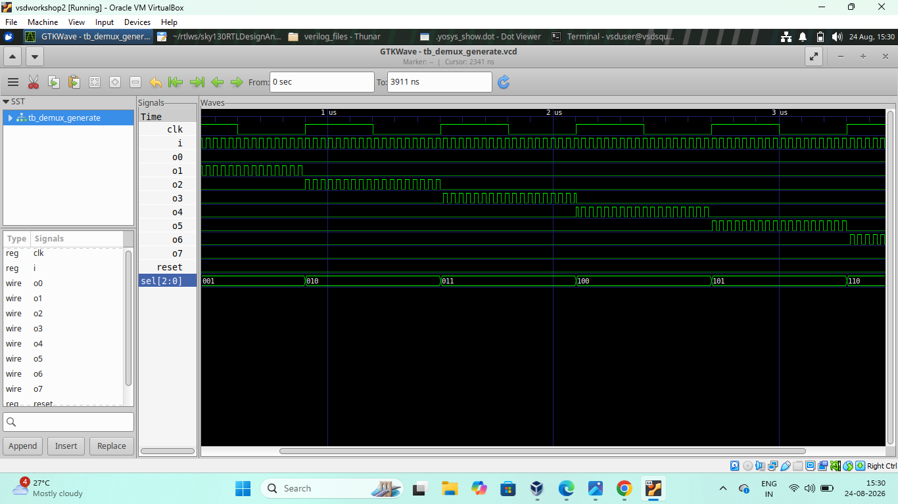

## Result

The waveform shows that the input signal is routed to the output
selected by the select signal.

## File

- `demux_generate_gtk.png` - GTKWave simulation result

---

# 9. DEMUX Case

## What I designed

In this experiment, I worked with a case-based implementation of a
Demultiplexer.

The case statement is used to select which output receives the input
signal.

## Simulation

The design was simulated and the output waveforms were observed using
GTKWave.

The input, select signal, and different output lines were analyzed.

### GTKWave Simulation Result

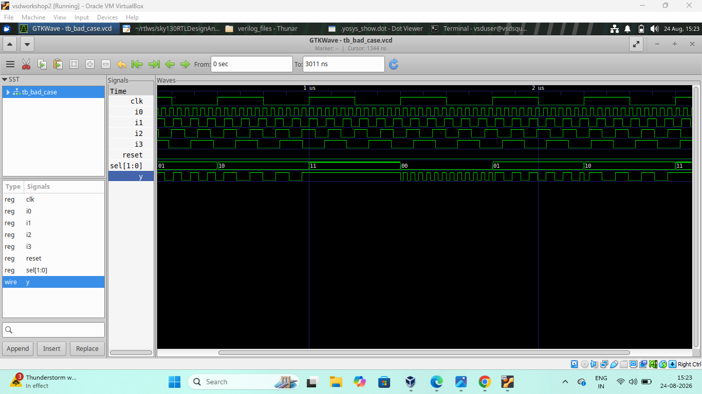

## Result

This experiment helped me understand how a case statement can be used
to implement a demultiplexer.

## File

- `demux_case_gtk.png` - GTKWave simulation result

---

# 10. Partial Case Assignment

## What I designed

In this experiment, I worked with partial assignments inside a case
statement.

A partial case assignment means that only some conditions are
assigned while other conditions are left without an assignment.

When an output is not assigned for all possible conditions, the
synthesis tool may infer a latch.

## Synthesis

The design was synthesized using Yosys.

The synthesized netlist and block diagram were observed to understand
the hardware generated from the partial case assignment.

### Yosys Synthesis Result

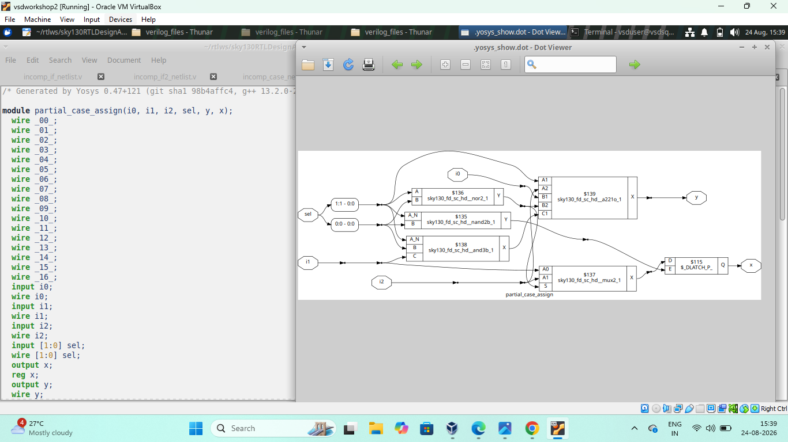

## Result

This experiment helped me understand how partial assignments in case
statements can affect the synthesized hardware and may result in
latch inference.

## File

- `partial_case_assign_yosys.png` - Yosys synthesized result

---

# 11. Ripple Carry Adder

## What I designed

In this experiment, I worked with a Ripple Carry Adder (RCA).

A Ripple Carry Adder is a digital circuit used to add two binary
numbers.

It is constructed using multiple full adders connected in series.
The carry output of one full adder is connected to the carry input of
the next full adder.

The carry propagates from the least significant bit to the most
significant bit.

## Simulation

The RCA was simulated to verify the addition operation.

The input numbers and sum output were observed using GTKWave.

The waveform shows the relationship between the input numbers and the
resulting sum.

### GTKWave Simulation Result

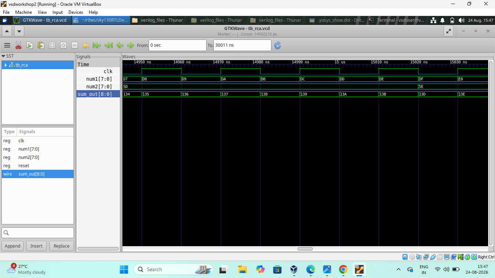

## Result

This experiment helped me understand the basic operation of a Ripple
Carry Adder and how binary addition can be implemented using digital
logic.

## File

- `rca.v_gtk.png` - GTKWave simulation result

---

# 12. RTL Simulation and Waveform Analysis

Simulation is an important step in RTL design because it allows the
functionality of the design to be verified before synthesis.

In Day 5, the RTL designs were simulated using the Verilog simulation
flow and the resulting waveforms were observed using GTKWave.

The waveforms were used to observe:

- Input signals
- Output signals
- Select signals
- Clock signals
- Reset signals
- Changes in output according to inputs
- Effects of incomplete assignments
- Multiplexer and demultiplexer operation
- Ripple Carry Adder operation

Waveform analysis helped me verify the behavior of the RTL designs
before analyzing their synthesized hardware.

---

# 13. Synthesis and Netlist Analysis

After RTL simulation, the designs were synthesized using Yosys.

Synthesis converts the RTL description into a gate-level hardware
representation.

The synthesized netlists and block diagrams were observed to
understand how the RTL code was converted into hardware.

The synthesis results helped me identify:

- Multiplexer logic
- Latch elements
- Logic gates
- Signal connections
- Hardware structures
- Hardware generated from incomplete assignments

By comparing the RTL code with the synthesized netlist, I could
understand the relationship between RTL coding style and actual
hardware implementation.

---

# 14. Latch Inference

One of the most important concepts learned in Day 5 was latch
inference.

A latch may be inferred when a combinational RTL block does not assign
a value to its output for every possible input condition.

For example:

```verilog
always @(*) begin
    if (i0)
        y = i1;
end
```

When `i0` is `0`, no new value is assigned to `y`.

Therefore, the synthesis tool may create a latch so that `y` retains
its previous value.

Similarly, an incomplete `case` statement can also result in latch
inference when some cases do not assign a value to the output.

To avoid unintended latches:

- Assign outputs for all possible conditions.
- Use complete `if-else` statements.
- Use complete `case` statements.
- Provide default assignments where required.
- Ensure that combinational outputs are assigned for every possible
  input condition.

---

# 15. Overall Learning

Through these experiments, I understood the following:

- How incomplete `if` statements work in RTL.
- How incomplete assignments can cause latch inference.
- How incomplete case statements affect synthesis.
- The difference between complete and incomplete case statements.
- How bad case statements can affect synthesized hardware.
- How complete case statements can implement combinational logic.
- How multiplexers are implemented using RTL.
- How demultiplexers route signals using select lines.
- How case statements can be used to implement a demultiplexer.
- How partial case assignments can result in latch inference.
- The working principle of a Ripple Carry Adder.
- How to simulate RTL designs using Icarus Verilog.
- How to observe waveforms using GTKWave.
- How to perform gate-level simulation.
- How to synthesize RTL designs using Yosys.
- How to analyze synthesized netlists and block diagrams.
- How RTL coding style affects the resulting hardware.
- The importance of complete assignments in combinational logic.
- How unintended latches can be avoided.
- How RTL simulation and synthesis are related.
- How Yosys converts RTL descriptions into hardware structures.

---

# 16. Conclusion

Day 5 helped me understand incomplete conditional logic and its
effect on RTL synthesis.

I worked with incomplete `if` statements, incomplete case statements,
bad and complete case statements, multiplexers, demultiplexers,
partial case assignments, and a Ripple Carry Adder.

The incomplete `if` and incomplete case experiments demonstrated how
missing assignments can cause latch inference during synthesis.

The bad case and complete case experiments helped me understand the
importance of properly specifying all possible conditions in
combinational RTL.

The MUX and DEMUX experiments helped me understand signal selection
and routing using select lines.

The partial case assignment experiment showed how incomplete
assignments can affect the synthesized hardware.

The Ripple Carry Adder experiment helped me understand binary
addition and carry propagation.

By comparing RTL simulation waveforms, gate-level simulation results,
and Yosys synthesized netlists and block diagrams, I understood how
RTL code is converted into hardware.

Overall, Day 5 improved my understanding of RTL coding practices,
latch inference, combinational logic, multiplexers, demultiplexers,
case statements, synthesis, and the relationship between Verilog RTL
code and the resulting hardware.
